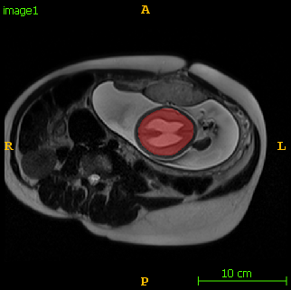

# Automatic Fetal Brain Localization and Segmentation 
This repository provides source code and pre-trained models for fetal brain localization and segmentation from fetal MRI. The method is detailed in [1]. If you use any resources in this repository, please cite the following papers:

* [1] Michael Ebner*, Guotai Wang*, Wenqi Li, Michael Aertsen, Premal A. Patel, Rosalind Aughwane, Andrew Melbourne, Tom Doel, Anna L. David, Jan Deprest, Sebastien Ourselin, Tom Vercauteren. "An automated localization, segmentation and reconstruction framework for fetal brain MRI." In International Conference on Medical Image Computing and Computer-Assisted Intervention (MICCAI), pp. 313-320. 2018. https://doi.org/10.1007/978-3-030-00928-1_36.

* [2] Eli Gibson*, Wenqi Li*, Carole Sudre, Lucas Fidon, Dzhoshkun I. Shakir, Guotai Wang, Zach Eaton-Rosen, Robert Gray, Tom Doel, Yipeng Hu, Tom Whyntie, Parashkev Nachev, Marc Modat, Dean C. Barratt, Sébastien Ourselin, M. Jorge Cardoso, Tom Vercauteren.
"NiftyNet: a deep-learning platform for medical imaging." Computer Methods and Programs in Biomedicine, 158 (2018): 113-122. https://doi.org/10.1016/j.cmpb.2018.01.025.

*    '*' authors contributed equally.

The following images show an example of detection and segmentation results.

For image reconstruction code, please refer to https://github.com/gift-surg/NiftyMIC.

# Requirements
* A CUDA compatable GPU with memoery not less than 6GB is recommended for training. For testing only, a CUDA compatable GPU may not be required.

* Tensorflow. Install tensorflow following instructions from https://www.tensorflow.org/install. Tested version 1.11.0 and 1.12.0.

* NiftyNet. Tested version is v0.2.0: https://github.com/NifTK/NiftyNet/releases/tag/v0.2.0.

* Demic (a tool to use NiftyNet). Tested version is v0.1: https://github.com/taigw/Demic/releases/tag/v0.1.

# How to use
* To get fetal brain detection and segmentation results, run `bash/inference.sh`. You need to edit the `PYTHONPATH` environment variable in that file so that it includes the path of NiftyNet and Demic.

* You can edit `cfg_data.txt` to customize the input and output image names.

# Acknowledgement
This work is part of the GIFT-Surg project (https://www.gift-surg.ac.uk/). It is supported by Wellcome Trust [WT101957; 203145Z/16/Z], EPSRC [EP/L016478/1; NS/A000027/1; NS/A000050/1], and the NIHR UCLH BRC.
